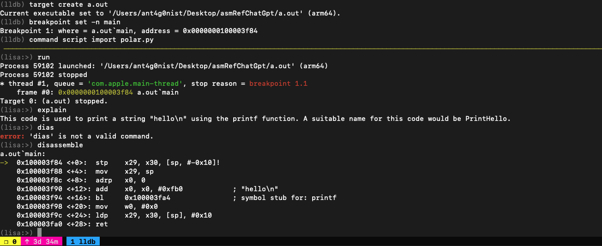
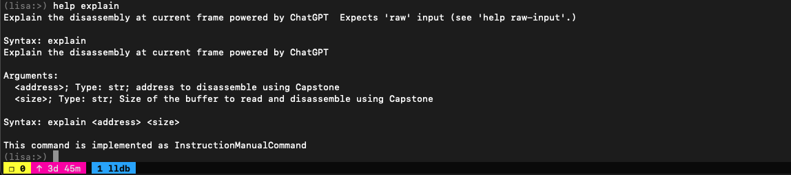
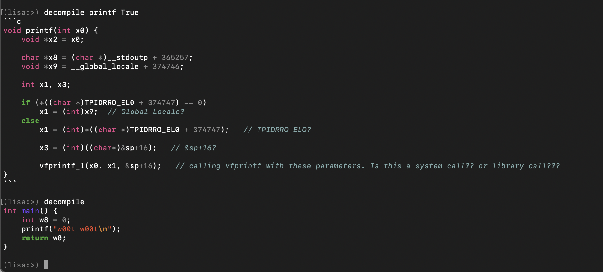
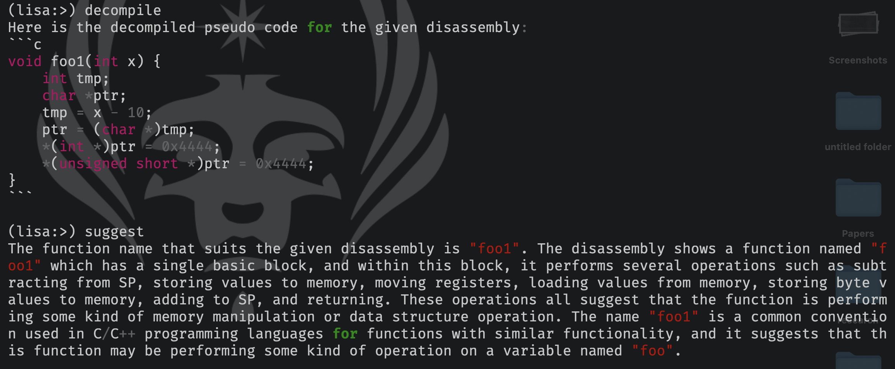

# Polar
LLDB plugin which queries OpenAI's davinci-003 language model to speed up reverse-engineering. Treat it like an extension of Lisa.py, an Exploit Dev Swiss Army Knife.

At the moment, it can ask `davinci-003` to explain what the current disassembly does. Here is a simple example of what results it can provide:

 

## Installation
```
curl -OL https://raw.githubusercontent.com/ant4g0nist/polar/master/polar.py
mv polar.py ~/polar.py
# Install Capstone


pip3 install capstone openai Pygments
echo command script import ~/polar.py >> ~/.lldbinit
```


## Usage
Currently, you can use polar either with Ollama or OpenAI ChatGPT.

### Ollama or OpenAI ChatGPT
#### Ollama
Using Ollama with Polar, now we can get up and running `Polar` with large language models, locally.

#### OpenAI ChatGPT
If you are ok paying for the usage of OpenAI's API, and do not mind sharing the disassembly of your target binary with OpenAI, you can use the `ChatGPT` model to get results.

### Configuring Ollama
Follow the instructions from [ollama](https://ollama.ai/) to install the `ollama` binary. Once you have installed `ollama`, you can configure `polar` to your favorite language model, either `codellama` or `llama2`.

If you want to use `codellama`, run this once to download the model
```bash
ollama run codellama
```

or if you want to use `llama2`, run this once to download the model
```bash
ollama run llama2
```

```bash
export LISA_OLLAMA_MODEL=codellama
export LISA_CHANNEL=ollama
lldb
(lldb) command script import ~/polar.py
```

### Configuring OpenAI ChatGPT

You need to set OPENAI_API_KEY env variable. You can obtain your openai token from : [Openai api-keys](https://beta.openai.com/account/api-keys)

```sh
export OPENAI_API_KEY=<your openai api token here>.
```

### Using Polar

```
lldb
(lldb) command script import ~/polar.py
(lldb) help explain
(lldb) help decompile
```







## Example:

 

## TODO
- [x] Add support for Langchain for Ollama
- [ ] Extend !exploitable command to use AI for analysis

## Acknowledgements

- Thanks to [JusticeRage](https://twitter.com/JusticeRage) for [Gepetto](https://github.com/JusticeRage/Gepetto)
- Thanks to [Ollama](https://github.com/jmorganca/ollama), Meta for llama2/codelama, [OpenAI](https://openai.com)
- [lldb](https://lldb.llvm.org/)
- [lisa.py](https://github.com/ant4g0nist/lisa.py)


