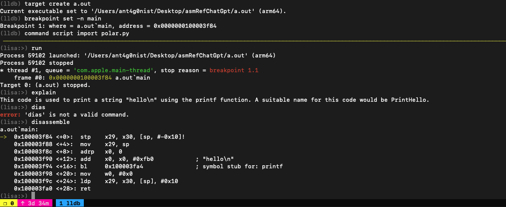
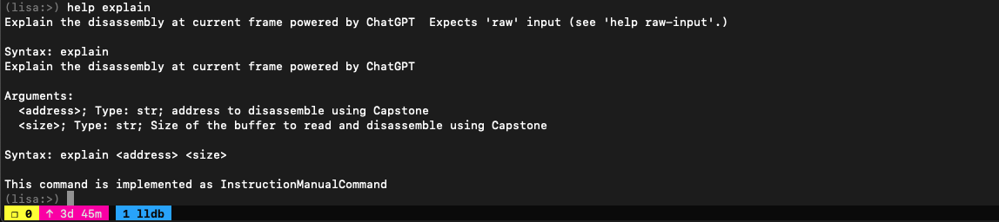

# Polar
LLDB plugin which queries OpenAI's davinci-003 language model to speed up reverse-engineering. Treat it like an extension of Lisa.py, an Exploit Dev Swiss Army Knife.

At the moment, it can ask `davinci-003` to explain what the current disassembly does. Here is a simple example of what results it can provide:

 

## Usage
```
curl -OL https://raw.githubusercontent.com/ant4g0nist/polar/master/polar.py
mv polar.py ~/polar.py
echo command script import ~/polar.py >> ~/.lldbinit
```

You need to set OPENAI_API_KEY env variable. You can obtain your openai token from : [Openai api-keys](https://beta.openai.com/account/api-keys)

```sh
export OPENAI_API_KEY=<your openai api token here>.
```

```
lldb
(lldb) help explain
```




### Example:

 


## Acknowledgements

- Thanks to [JusticeRage](https://twitter.com/JusticeRage) for [Gepetto](https://github.com/JusticeRage/Gepetto)
- Thanks to [OpenAI](https://openai.com) for making this incredible bot
- [lldb](https://lldb.llvm.org/)
- [lisa.py](https://github.com/ant4g0nist/lisa.py)